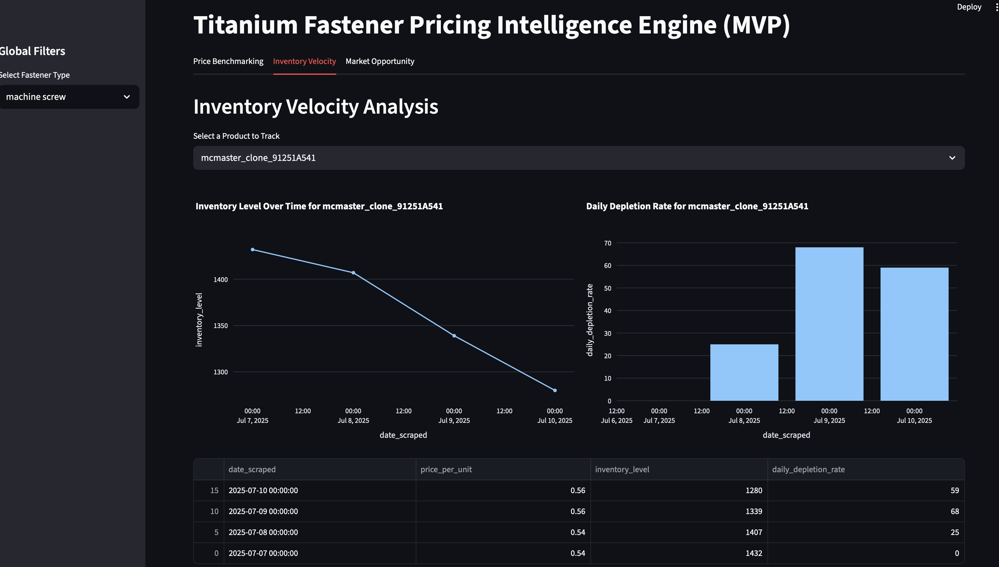

# titanium_scraper
## MVP

**How to run**

Install libraries
```bash
$ pip install -r requirements.txt
```


Set up virtual environment:

```bash
# activate
$ python3 -m venv .venv
$ source .venv/bin/activate

# deactivate
$ deactivate
```

Running scripts:

```bash
# This will simulate the scraper generating some pricing history
$ python3 run_daily_scrape.py

# Your web browser will open with the interactive application, running locally.
$ streamlit run dashboard.py

```

### Dashboard




